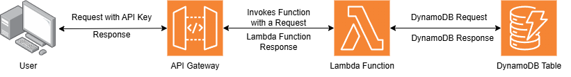

# Customer Details Storage Application (API Gateway - Lambda Function - DynamoDB)

1. [Introduction](#introduction)
2. [Architecture](#architecture)
3. [Prerequisites](#prerequisites)
4. [Steps](#steps)
5. [Resources](#resources)

## Introduction
In this use case, we will be looking into how to create a customer details management application using completely AWS native serverless services. We will also look into how to deploy the required infrastructure using Cloud Formation Templates and how to test the application endpoints. More details on this can be seen in later part of the article. 

## Architecture
  
1. User sends requests using endpoints provided by API Gateway.  
2. API Gateway checks for API Key authenticity, if everything matches out then it invokes the Lambda Function with request as a event.  
3. Lambda Function processes the request and performs necessary operation with DynamoDB.
4. Once the operation with DynamoDB is complete then it sends the response back. 
5. At last API Gateway sends the response back to user. 

## Prerequisites
1. AWS Account with necessary permissions.
2. Python
3. Code editor

## Steps
### Deploying the required resources
Use the following Cloud Formation [Template](./Cloud%20Formation%20Templates/CFT.yaml) to create required resources. You can use the default values provided in the template or you can change it based on your needs. This template is fully capable of deploying and configuring all the resources, therefore no manual steps are needed. Once you execute the template, make sure that all resources are created successfully and then move to next step.

### Configuring Lambda Function 
Cloud Formation would have created a Lambda Function with default basic code. You need to replace it with actual code which can be found in this link. This can be done by going to Lambda Function console and replacing the existing code with actual code. Once this is done click on deploy icon to deploy the code. 

### Configuring the API Requests. 
API Requests in this solution needs to be executed with API Key. This key can be found in [console](./Artifacts/Images/API%20Key%20Console.png). This key needs to be provided in the header section of API Request with x-api-key [tag](./Artifacts/Images/API%20Key%20PM.png). All the APIs can be seen in triggers section of Lambda Function [console](./Artifacts/Images/API%20Endpoints%20LFC.png) and they can be copied from their to Postman.  This solution provides [healthCheck](./Artifacts/Images/healthCheck.png), [createCustomer](./Artifacts/Images/createCustomer.png), [getCustomerDetails](./Artifacts/Images/getCustomer.png), [updateCustomer](./Artifacts/Images/updateCustomer.png) and [updateCustomerEmail](./Artifacts/Images/updateCustomerEmail.png) requests. All the requests needs to be executed with API Key. Also the request body format should be as per DynamoDB compatibility. You can refer the images provided in above links to create proper API requests. Once done test all the requests and make sure that you are getting proper responses.  
Note : Sometimes during setup if API Requests are giving Internal Server Error, then go to API console and execute [deploy](./Artifacts/Images/Deploy%20API.png) API Command. This will re-deploy all the APIs and it will solve the problem.   

### Clean Up
As Cloud Formation Template was used to create required resources. All the resources can be removed by just deleting the Cloud Formation Stack. It is as simple as that. 

## Resources
1. [AWS Lambda Documentation](https://docs.aws.amazon.com/lambda/latest/dg/welcome.html)
2. [AWS DynamoDB Documentation](https://docs.aws.amazon.com/amazondynamodb/latest/developerguide/Introduction.html)
3. [AWS API Gateway Documentation](https://docs.aws.amazon.com/apigateway/latest/developerguide/welcome.html)
4. [AWS Boto3 DynamoDB Documentation](https://boto3.amazonaws.com/v1/documentation/api/latest/reference/services/dynamodb.html)

